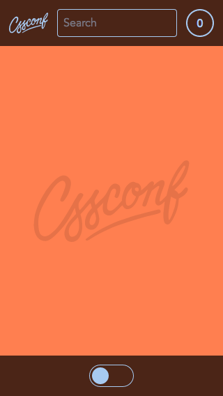
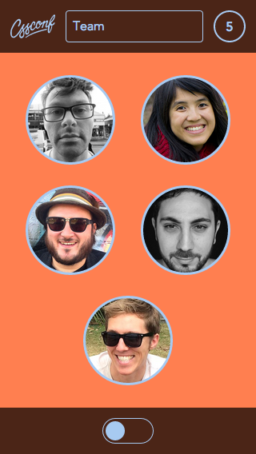

# CSSConf App

> Note: This is totally fake and just used as a __demo__ for my "Styling with STRINGS" talk at [CSSConf AU 2014](http://2014.cssconf.com.au/).

 &nbsp; 

If you have seen the talk and wanna play around a bit with the Flexbox reordering or `color` and `font-size` changing, you can do that in the:

[Live Demo](http://simurai.github.io/cssconf-app)

> Note: The loading can take a while since the app is not optimized for production. That way it's easier to understand the source.


## How to customize

Just open the inspector/DevTools and start by changing these properties for the root `html` element:

```css
html {
    font-size: 16px;
    color: hsl(212, 72%, 80%);
    background: coral;
}
```

or limit it to the header/footer `.Bar`s only,

```css
.Bar {
    font-size: ???;
    color: ???;
    background: ???;
}
```

or any other element.


## Made with

The app uses the [Digit](https://github.com/montagejs/digit) UI Set that runs on [MontageJS](https://github.com/montagejs/montage)


## Support

Should work in most browsers, although the animations are only WebKit prefixed
